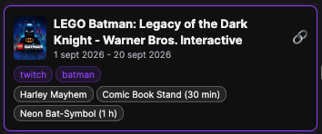
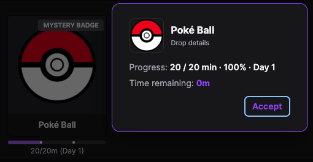
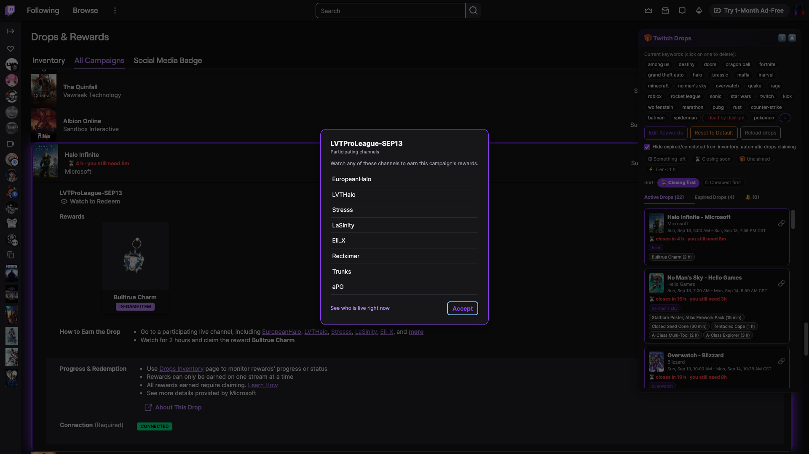
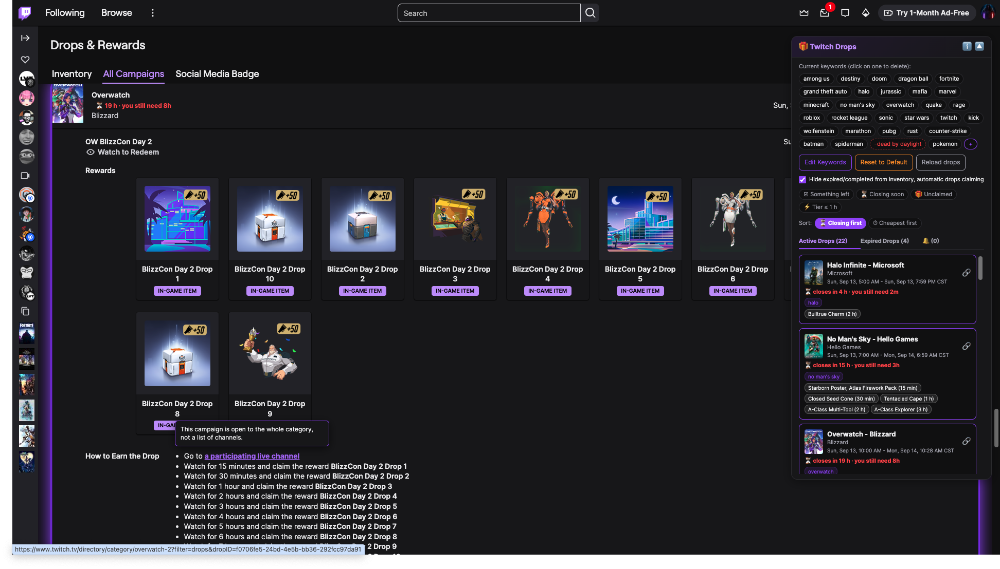

# Twitch Drops Highlighter + Keywords

Userscript that classifies and highlights drops/campaigns on Twitch based on your keywords. / Userscript que clasifica y resalta drops/campañas en Twitch según tus palabras clave.

> [!NOTE]
> **THE INVENTORY CHECKBOX ALSO CLAIMS / LA CASILLA DEL INVENTARIO TAMBIÉN RECLAMA:** *hide expired/completed* turns on automatic claiming as well, which its label does not say. It claims by clicking Twitch's own Claim buttons for drops you already earned by watching: the script's own requests to Twitch are read-only, nothing is sent to claim, and it grants you nothing you could not click yourself. It is still automation, which Twitch's terms may not permit, so decide with that in mind. / *Ocultar cerrados/completados* activa además la reclamación automática, algo que su etiqueta no dice. Reclama pulsando los propios botones «Reclamar» de Twitch, sobre drops que ya te ganaste viendo: las peticiones propias del script a Twitch son de solo lectura, no se envía nada para reclamar, y no te da nada que no pudieras pulsar tú. Sigue siendo automatización, que las condiciones de Twitch pueden no permitir, así que decide sabiéndolo.
>
> **It also clears up after the claim / Además recoge lo que el reclamo deja detrás:** the same checkbox opens your Twitch notification centre and **permanently deletes the notifications that mention a drop** —that is Twitch's own delete button, so it cannot be undone and *Reload drops* does not bring them back— and it dismisses the «Drop claimed» banner. **A drop handed out as a redeemable code is never deleted**, whatever its notification says: for every other drop the notice is redundant —what it announces is already in your inventory— but that one *is* the code, and deleting it can mean losing it. They are recognised from your own rewards history, by name and by the image's asset, and if the inventory has not arrived nothing is swept at all: keeping stray notices is clutter, losing one is a code. Only those two things are touched: notifications about anything else stay where they are. / la misma casilla abre tu centro de notificaciones de Twitch y **borra de forma permanente las notificaciones que mencionan un drop** —es el propio botón de borrar de Twitch, así que no se puede deshacer y *Recargar drops* no las devuelve— y descarta el banner «Drop reclamado». **El aviso de un drop entregado como código no se borra nunca**, diga lo que diga: el de cualquier otro drop es redundante —lo que anuncia ya está en tu inventario— pero ése *es* el código, y borrarlo puede ser perderlo. Se reconocen desde tu propio historial de recompensas, por el nombre y por el asset de la imagen, y si el inventario no ha llegado no se barre nada: quedarse con avisos de más es un estorbo, quedarse sin uno es un código. Solo toca esas dos cosas: las notificaciones de cualquier otro asunto se quedan donde están.

**⚡ Quick install / Instalación rápida:** **[Install / Instalar](https://github.com/g31w0fw0rld/twitch-drops-highlighter/raw/main/twitch-drops-highlighter.user.js)** — also on / también en [GreasyFork](https://greasyfork.org/scripts/573570) · [OpenUserJS](https://openuserjs.org/scripts/g31w0fw0rldgmail.com/Twitch_Drops_Highlighter_+_Keywords_%28Full_+_i18n%29).

> You need a userscript manager first: [Violentmonkey](https://violentmonkey.github.io/) (open source) or [Tampermonkey](https://www.tampermonkey.net/). On Chrome and Edge, also turn on **Allow user scripts** on the extension's own page in `chrome://extensions` — without it nothing runs. Step-by-step under [English](#english).
>
> Necesitas antes un gestor de userscripts: [Violentmonkey](https://violentmonkey.github.io/) (código abierto) o [Tampermonkey](https://www.tampermonkey.net/). En Chrome y Edge, activa además **Allow user scripts** en la página de la propia extensión en `chrome://extensions`; sin eso no se ejecuta nada. Pasos detallados en [Español](#español).

*Campaigns: matching campaigns get outlined **purple** on the page itself, and each one says what it still costs you right there — here *Fortnite* is about to close, so it reads **⏳ 34 h · you still need 30m** in red; a campaign with no hurry carries a plain grey **⏱** with the time instead. *Apex Legends* right above it has no mark and no outline at all, which is the point: it did not match a keyword. The panel lists the same campaigns with their rewards, the hours each one needs, the filter chips and the sort, and **the ones you already own are ticked and struck through** so what stands out is what is left. / Campañas: las campañas que coinciden se enmarcan en **morado** en la propia página, y cada una dice ahí mismo lo que todavía te cuesta — aquí *Fortnite* está por cerrar, así que lleva **⏳ 34 h · te faltan 30m** en rojo; una campaña sin prisa lleva en su lugar un **⏱** gris con el tiempo. *Apex Legends*, justo encima, no lleva marca ni marco, que es de lo que se trata: no casó con ninguna keyword. El panel lista esas mismas campañas con sus recompensas, las horas que pide cada una, las etiquetas de filtro y el orden, y **las que ya tienes van con ✓ y tachadas**, para que lo que resalte sea lo que falta.*

*Expired: same idea in **red**, so a campaign that closed is obvious rather than something you find out by clicking. The tab keeps its own count, and the filters never touch it — there is nothing left to decide there. These cards carry **no 🔗 either**: sharing a closed campaign is sending somebody after something they can no longer get. / Cerrados: lo mismo en **rojo**, para que una campaña que ya cerró se vea, en vez de descubrirlo al hacer clic. La pestaña lleva su propia cuenta, y los filtros no la tocan: ahí ya no hay nada que decidir. Estas tarjetas **tampoco llevan 🔗**: compartir una campaña cerrada es mandar a alguien a por algo que ya no puede conseguir.*

*Inventory: hovering a drop in progress shows **exactly how much watch time is left** — Twitch only gives you a bar and a rounded "6% of 30 minutes". Each entry also gets an ✕ to take it out of the view. And the panel beside it **is full here too**: it fills from Twitch's own API, so it lists every campaign that matched even though this page shows none of them, with its keyword, its 🔗 to share it and **the rewards you already own ticked and struck through** one by one. Above the tabs sit the four filter chips and the two sort chips. / Inventario: al pasar el ratón por un drop en progreso sale **cuánto tiempo de visualización falta exactamente** — Twitch solo te da una barra y un "6% of 30 minutes" redondeado. Cada entrada tiene además una ✕ para sacarla de la vista. Y el panel de al lado **aquí también está lleno**: se llena de la propia API de Twitch, así que lista todas las campañas que coincidieron aunque esta página no enseñe ninguna, con su palabra clave, su 🔗 para compartirla y **las recompensas que ya tienes con ✓ y tachadas** una a una. Encima de las pestañas están las cuatro etiquetas de filtro y las dos de orden.*

*The same thing up close, because in the shot above it is a few pixels: the box is **the script's own**, not the browser's `title` — it comes up in a quarter of a second, in the widget's own palette, and it recomputes the figure every time you point at it, so it never shows a number from half an hour ago. Twitch says «6% of 30 minutes»; this says **28m**. / Lo mismo de cerca, porque en la captura de arriba son cuatro píxeles: la caja es **la del propio script**, no el `title` del navegador — sale en un cuarto de segundo, con la paleta del widget, y recalcula la cifra cada vez que la apuntas, así que nunca enseña un número de hace media hora. Twitch dice «6% of 30 minutes»; esto dice **28m**.*

*Clicking that same drop opens the full detail: progress in minutes and percent, plus the time remaining. It is the same drop and the same moment as the two shots above — **2 / 30 min · 7%** and the same **28m** — so what the box says on hover and what the detail says agree. / Al hacer clic en ese mismo drop se abre el detalle completo: progreso en minutos y porcentaje, más el tiempo restante. Es el mismo drop y el mismo momento que las dos capturas de arriba —**2 / 30 min · 7%** y los mismos **28m**—, así que lo que dice la caja al pasar el ratón y lo que dice el detalle coinciden.*

*Every card says **which keyword found it**, so a card is never there without a reason on it — a card that cannot explain itself is indistinguishable from a filter that has gone wrong. Here both reasons are in plain sight, and they come from different halves of the title: `grand theft auto` from the game and `twitch` from its owner, **Twitch Gaming**. Below them, **what you already own is ticked and struck through one reward at a time** — four here, with **nopixel V Sub Badge (sub)** left plain because it is still to be earned — and it now says *why* it is: it asks for a **subscription**, not for watch time, which is the one cost the panel used to leave blank. Look at the two **GTA$250K**: it is the same reward handed out at two different watch-time tiers, and each tier keeps its own chip and its own mark, because the tier is the unit you claim. / Cada tarjeta dice **qué palabra clave la encontró**, así que nunca aparece sin un motivo encima — una tarjeta que no se explica no se distingue de un filtro que falla—. Aquí los dos motivos están a la vista, y salen de mitades distintas del título: `grand theft auto` del juego y `twitch` de su propietario, **Twitch Gaming**. Debajo, **lo que ya tienes va con ✓ y tachado, recompensa a recompensa** —cuatro aquí, con **nopixel V Sub Badge (sub)** sin marcar porque queda por ganar, y ahora dice *por qué* queda: pide una **suscripción**, no tiempo de visionado, que era el único coste que el panel dejaba en blanco—. Fíjate en los dos **GTA$250K**: es la misma recompensa repartida en dos tramos de visualización distintos, y cada tramo conserva su propio chip y su propia marca, porque el tramo es lo que se reclama.*

*And the case that looks like a bug and is not: **the chip can name a word that is nowhere on the card**. Read this one — «Marvel Rivals», by **Marvel Rivals** — and `marvel` is right there twice, but `twitch` is not, not in the game and not in the owner. It matched the **campaign's own name**, which Twitch keeps in its API and never prints here. The chip is what makes that visible: without it the card would look like it walked in uninvited. Where you see it is on the cards the panel fills **from the API** — the sections you are not standing in front of —, because a row you have on screen explains itself with the text the page shows; the short date range is the tell, written by the script rather than copied off the page. Below it, the other half of what a card is for: **every reward carries what it still costs you** — 2 h and 4 h here — and the two you already own are ticked, struck through and stripped of their cost, because the time they used to ask for no longer buys you anything. / Y el caso que parece un fallo y no lo es: **el chip puede nombrar una palabra que no está en ninguna parte de la tarjeta**. Lee esta —«Marvel Rivals», de **Marvel Rivals**— y `marvel` está ahí dos veces, pero `twitch` no, ni en el juego ni en el propietario. Casó por el **nombre de la propia campaña**, que Twitch guarda en su API y aquí no imprime nunca. El chip es lo que lo hace visible: sin él, la tarjeta parecería haberse colado sola. Donde se ve es en las tarjetas que el panel llena **desde la API** —las secciones que no tienes delante—, porque una fila que tienes en pantalla se explica con el texto que la página enseña; la pista es la ventana de fechas corta, que la escribe el script y no se copia de la página. Debajo, la otra mitad de para qué sirve una tarjeta: **cada recompensa lleva lo que todavía te cuesta** —2 h y 4 h aquí— y las dos que ya tienes van con ✓, tachadas y sin coste, porque el tiempo que pedían ya no te compra nada.*

*A **reward campaign hands out containers, not rewards**: a Poké Ball is a box that opens by itself once you have watched enough, and what comes out of it is a chat badge — here **Pichu**, on the left as Twitch shows it. Twitch records the badge and never the ball, so the ball can never be ticked for being in your history; it is ticked by **counting**. What the panel counts is per campaign: once a campaign has handed you something, that box is spent for you and gets struck. That is why this card carries **two different ticks**: **Poké Ball** is struck through because its campaign already gave — and **Pichu** is what came out of it. The two **Great Ball** chips stay unmarked **on purpose**, because their campaigns have given nothing yet, and marking a box you can still earn would hide it. Note what the first one now says it costs: a **sub**. It is the one reward that is not bought with time, and the panel used to leave that chip blank. Look at the title too, because it is the same word spelled two ways: Twitch prints the game as **Pokémon** and its owner as **Pokemon**, and the API calls this very campaign «First Partners Collection - Pokemon», which looks like neither. The card finds its rewards anyway because the match is made on the brand and **accents are folded on both sides** — the same reason the keyword `pokemon`, with no accent, found a campaign that carries one. / Una **campaña de recompensas reparte contenedores, no recompensas**: una Poké Ball es una caja que se abre sola al cumplir el tiempo, y lo que sale de ella es un emblema de chat — aquí **Pichu**, a la izquierda tal y como lo enseña Twitch. Twitch apunta el emblema y nunca la bola, así que la bola no puede marcarse por constar en tu historial: se marca **contando**. Lo que el panel cuenta es por campaña: en cuanto una campaña te ha dado algo, esa caja está gastada para ti y sale tachada. Por eso esta tarjeta lleva **dos ✓ que dicen cosas distintas**: **Poké Ball** sale tachada porque su campaña ya dio, y **Pichu** es lo que salió de ella. Los dos chips de **Great Ball** se quedan sin marca **a propósito**, porque sus campañas no han dado nada todavía, y marcar una caja que aún puedes ganar sería esconderla. Fíjate en lo que el primero dice ahora que cuesta: una **sub**. Es la única recompensa que no se paga con tiempo, y el panel dejaba ese chip en blanco. Fíjate también en el título, porque es la misma palabra escrita de dos formas: Twitch imprime el juego como **Pokémon** y a su dueño como **Pokemon**, y la API llama a esta misma campaña «First Partners Collection - Pokemon», que no se parece a ninguna de las dos. La tarjeta encuentra sus recompensas igual porque el cruce se hace por la marca y **los acentos se pliegan en los dos lados** — que es lo mismo que hace que la keyword `pokemon`, sin acento, encuentre una campaña que lo lleva.*

*The same campaign from an account that has **not** opened its ball yet — and the reason the detail box writes the day next to the percentage. **100% does not mean done here**: a Poké Ball costs 20 minutes on each of three separate days, so this is 100% of **Day 1** and the ball stays shut. Twitch shows it as a **MYSTERY BADGE** until it opens. Left alone, «100%» and «0m remaining» would read as a finished drop waiting to be claimed, which is the one thing this drop can never be — there is no button, it opens by itself. / La misma campaña desde una cuenta que **no** ha abierto su bola todavía — y el motivo de que la caja de detalle escriba el día junto al porcentaje. Aquí **100% no significa terminado**: una Poké Ball cuesta 20 minutos en cada uno de tres días distintos, así que esto es el 100% del **día 1** y la bola sigue cerrada. Twitch la enseña como **EMBLEMA MISTERIOSO** hasta que se abre. Sin ese añadido, «100%» y «faltan 0m» se leerían como un drop hecho esperando a que lo reclames, que es justo lo que este drop no puede ser: no hay botón, se abre solo.*

*Twitch's own **«go to a participating live channel»** points at the category with the drops filter on, and that lists everybody wearing the drops tag whether or not they are in this campaign — the tag is put on by the channel, so it promises nothing. The script points that same link **at the campaign**, and marks it **bold** so you can see which link changed. Where the campaign has a channel list, clicking it opens the list instead: these eight names come from Twitch's own API — the same eight twitchdrops.app publishes for this campaign. The link to the directory stays **inside** the box, at the bottom, because the two answer different questions: the list is who **may**, the directory is who is **live right now**. Ctrl-click still opens the link the way it always did. / El **«ve a un canal en vivo que participe»** de Twitch apunta a la categoría con el filtro de drops, y eso lista a todo el que lleve el tag puesto, participe o no en esta campaña — el tag lo pone el canal, así que no promete nada. El script apunta ese mismo enlace **a la campaña**, y lo marca **en negrita** para que se vea cuál cambió. Donde la campaña tiene lista de canales, el clic abre la lista: estos ocho nombres salen de la propia API de Twitch, los mismos ocho que publica twitchdrops.app para esta campaña. El enlace al directorio se queda **dentro** de la caja, al pie, porque responden a preguntas distintas: la lista es quién **puede** y el directorio quién está **en directo ahora**. Con ctrl, el enlace se sigue abriendo como siempre.*

*And where there is no list to show, **the link stays a link** and says why. Four campaigns out of five are open to the whole category —21 of the 26 measured on a real account—, so a box there would only say «this has no list, take the link you were about to use»: a click of toll. What decides it is **the API and not a guess** — the campaign's channel list is asked for the moment you point at the link, so by the time you click, the answer is already in. The hint comes in the script's own box, the same one every other hint it writes uses. / Y donde no hay lista que enseñar, **el enlace sigue siendo un enlace** y dice por qué. Cuatro de cada cinco campañas están abiertas a toda la categoría —21 de las 26 medidas sobre una cuenta real—, así que una caja ahí solo diría «esto no tiene lista, toma el enlace que ibas a usar»: un clic de peaje. Quien lo decide es **la API y no una suposición**: la lista de canales de la campaña se pide en cuanto apuntas el enlace, así que cuando llega el clic la respuesta ya está. El aviso sale en la caja propia del script, la misma que usan todos los demás.*

## English

### What it does

**Highlighting**
- Marks the campaigns on Twitch's Drops & Rewards page that match your keywords, **on the page itself** — purple for open, red for closed — so you spot them while scrolling instead of opening each one.
- Campaigns that match nothing are left exactly as they were.

**The panel**
- A floating panel, collapsible and remembered, listing what matched split into **Active** and **Expired**, each with a count so you know at a glance whether it is worth looking.
- **It fills from Twitch's own API, so it works in the inventory too** — the same query the campaigns page uses, which returns the whole list in one request. Earlier versions had to jump to the campaigns tab and come back to read it off the page, blocking the screen while they did; now nothing moves you off the tab you are on. While the answer is still on its way the panel stays quiet rather than reporting a zero it does not know yet.
- Every entry shows the campaign, the studio, the exact window it runs, the keyword that matched it and **each reward with the hours needed to unlock it** — the thing Twitch makes you click through to find. **The keyword is always there**, including when what matched was the campaign's own name, which never appears in the title Twitch prints on the card. A card with no explanation is indistinguishable from a filter that has gone wrong.
- **Rewards you already own are marked** — ticked, struck through and dimmed, one by one, so what is left to earn is what stands out. Two rewards that ask for the same watch time are not the same drop, so each one is checked separately, and when every reward on a badge is already yours the badge drops the watch time it asked for and says **Claimed** on hover instead. **Twitch emotes and chat badges count too**, and they used not to: Twitch hands those out on its own when the time is done, so they never pass through the claim button and did not show up where the rest of your rewards are recorded. They were showing as still owed for good. **What a campaign hands out in a container is marked apart**: the badge collections Twitch runs sitewide give you a ball, and the ball opens by itself into a chat badge, so what is recorded is the badge and not the ball — the badge is listed with its ✓ and the ball is left alone, because the campaign can still give you more.
- **A reward that asks for subscriptions says so.** Some of the sitewide badge collections are not unlocked by watching but by subscribing, and Twitch gives those tiers a watch time of zero — so they used to arrive as a bare chip with nothing on hover: the only chip that said nothing at all, and the only one that costs money rather than time. Such a tier now says it needs a **sub** and, on hover, that it unlocks with subscriptions rather than by watching. It says *that* a subscription is needed, not how many: the number Twitch declares does not match what the campaign actually asks — Pokémon's *First Partners Collection* hands out three badges at one Great Ball per subscription, so three, while the API declares two and the three is in no field of the response. The kind of requirement is what is certain, and it is what changes the decision: this one is not earned by watching, it is paid for. How many is on the campaign's own page. **An ordinary drop campaign can ask for a subscription too**, and that is where most of them are: the chat badges Twitch hands out for subscribing — nopixel V, Harley Mayhem, Sorcerer Rogier and friends — arrive with zero watch time and their requirement in a different field (`requiredSubs` on the tier, not `subsGoal` on the group), which is why those stayed silent while the Pokémon ball spoke. Both are read now. What is left exactly as it was is a tier that asks for neither: the script reads Twitch's own fields instead of guessing from the zero, so a reward that really is free never grows a price it does not have.
- **What you already earned but have not collected gets its own mark** — 🎁 and highlighted, never dimmed, because it is the one thing on the badge still waiting on you. It is not "almost there": the watch time is done, only the click is missing, and it expires with the campaign like everything else. The closing warning counts them, so a campaign about to end tells you how much you are about to throw away.
- **What is about to close rises to the top.** When a reward you do not own yet is running out of time, the card says how long is left and how much watch time you still need — red under 24 hours, amber under 72 — and the active list is ordered by whatever closes first. If the time no longer fits, it says so, instead of letting you start something you cannot finish. The same ⏳ lands on the campaign's own card on the page, so the hurry is visible while you scroll.
- **🔗 copies an open campaign so you can pass it on** — its name, its dates, every reward with the hours it needs, and a link that opens that campaign on Twitch rather than the list. It is copied as text, not as an image, so it stays searchable and the link stays clickable wherever you paste it. Your own ✓ and 🎁 are left out on purpose: what you have claimed is yours, not the campaign's, and it means nothing to whoever you send it to. Closed campaigns have no 🔗 — sending one is sending somebody after something they can no longer get.
- **Reload drops** re-queries without a page refresh, and also brings back anything you dismissed from the inventory.

**Keywords**
- The list ships with about 30 popular franchises and it is yours to change.
- **Click a chip to delete it**, **+** to add, **Edit Keywords** to rewrite the whole list as one comma-separated line, and **Reset to Default** to start over. Each change reloads so the highlighting is rebuilt.
- **A keyword starting with `-` excludes instead of matching.** `rust` plus `-console` finds Rust and drops the console spin-off, even though `rust` is right there in its name. An exclusion beats every match, and it removes the campaign everywhere at once: no highlight on the page, no card in the panel, no 🔔. Existing alerts for what you just excluded are cleared as you add it.

**View filters**
- Four chips above the tabs — **☑ something left**, **⏳ closing soon**, **🎁 unclaimed**, **⚡ Tier ≤ 1 h** — narrow what the panel shows. They are a lens, not a second keyword list: the page highlighting, the card marks and the notifications are untouched, so switching one on costs nothing and needs no reload.
- They **add up**: turn on ⏳ and ⚡ together and you get what closes soon *and* can still be finished in an hour. They only trim the **active** tab — in expired there is nothing left to decide.
- **⚡ measures what you have left**, not what the campaign advertises: a 30-minute tier you already claimed does not make it a quick one.
- Filters are **remembered between reloads**, so the tab counts what is showing out of what there is — `Active Drops (3/12)` — and an empty list says the filters hid it, with a link to clear them. A filter you forgot about never looks like an empty day.
- **Nothing is hidden on a guess.** Until the inventory has loaded, the script cannot tell what is claimed or earned, so the state filters let everything through rather than emptying the panel while it starts up.
- **When the inventory has not arrived, the panel says so.** Without it the script cannot know what you own or how much you have watched, so the ✓, the 🎁, the "you still need" and the state filters all go quiet at once. A warning after a few seconds is the difference between a slow day and a panel that knows nothing about you.
- **Sort the open list your way:** by whatever closes first (the default — a deadline is the only thing that runs out on its own) or by whatever asks the least time. The two chips sit under the filters. Sorting by cheapest puts a reward you already earned at the very top: nothing is left to watch there, only a click.

**On the page itself**
- **Every open campaign shows what it still costs you**, on its own card, without opening the panel: ⏱ and the watch time you need to take **everything** that is left, which is its most expensive remaining reward — the watch time is per campaign, so one long session covers all its rewards at once and the total is not their sum. A campaign closing within 72 hours shows the deadline and the time needed together — the deadline alone does not tell you whether it is worth starting. If finishing no longer fits in the time left but the cheapest reward still does, hovering the mark says so in brackets, because there is still something to salvage.

- **The «participating live channel» link points at the campaign, not at the tag.** Twitch links the category with `filter=drops`, which lists whoever wears the drops tag; the script adds the campaign to that link, so the listing is the campaign's, and the changed link goes **bold**. Where the campaign has a channel list, clicking opens it — the names come from Twitch's own API, and the directory link stays inside the box, because one says who may and the other who is live right now. Where it is open to the whole category —four campaigns out of five— the link stays a link and the hint says so.

**Inventory**
- **Hide expired/completed from the inventory** — one checkbox that also turns on **automatic claiming** of drops you have already finished. Read the warning above before ticking it.
- **What it clears is what you already have of a campaign that still owes you something.** A campaign with nothing left in progress is left exactly as Twitch draws it, block and rewards: it is the only place that shows what you won there, and emptying it reads as having lost your inventory rather than as tidying up. Nothing the script hides can ever span more than one campaign — that is checked on every sweep, and anything hidden is checked again afterwards and comes back on its own if it stops fitting.
- **Hover a drop in progress and it tells you the exact watch time left.** Twitch gives you a bar and a rounded percentage; the script turns that into minutes you can actually plan around.
- **Every hint the script writes comes in its own box**, anchored to the control and in the panel's own palette. Twitch does have a tooltip component of its own and it is deliberately not reused: its class names are build-time hashes that change with every deploy, and the resulting box would be Twitch's inside a widget that is not Twitch's. The `title` stays underneath as the fallback and as the accessible name. Controls that already say what they do keep no hint — the label carries the destination — and the two that are only an icon (ℹ️ and the collapse chevron) finally say what they are for.
- **Click the same drop for the full detail:** progress in minutes and percent, plus the time remaining. If the progress cannot be worked out, the click is passed through to Twitch untouched rather than swallowed.
- **Dismiss any entry with ✕** to clear the clutter of things you do not care about; *Reload drops* brings them all back.
- **The same «participating live channel» link, here too.** Twitch writes it on every campaign you have in progress, and the script does the same thing with it as on the campaigns page: points it at the campaign, marks it bold, and opens the channel list where there is one. On this page it does not have to ask the API which campaign it belongs to — Twitch prints the campaign's own link right beside it, so the two halves are already in the DOM.
- **A campaign that closed without you finishing it goes too.** It used to stay put: a bar at 45% read as «there is still something to win», and a full bar hit the rule that leaves a fully claimed campaign alone — so it was not one guard letting it through but both, and it got no ✕ either, so there was no removing it by hand. Whether it closed is decided by Twitch's API and never by the page, whose end date and «no longer available» line are translated into 28 locales. And once the panel has stopped listing it —which happens within days of it closing— the campaign is asked about by the id Twitch writes in its own link: one query, and only for the ones the panel does not know. If the answer does not say, it stays in view; a claim button inside is enough to leave it alone too, because what expires is the time to earn it, not always the time to collect it.
- **Chat-badge campaigns count as campaigns too.** Twitch runs a second kind — sitewide, no game attached, handing out badges instead of in-game items; the Pokémon Poké Balls are one. They used to fall out of everything here: no ✕, the checkbox would not hide them and clicking them opened nothing, because the whole sweep started from a class Twitch only puts on some of the pictures and that one has none. And their progress is per day (`6/20m (Day 1)`), so the modal says which day it is instead of claiming you are done at 100%.

**Change notifications**
- Watches the campaign list and flags what changed since you last looked. The 🔔 tab carries a **pending count** and lists the affected campaigns by name.
- **A 🔔 also lands on the campaign's own card** on the page, so a change is visible where you are already looking and not only inside the panel.
- **The 👁️ button marks one as seen and takes you to it** — on the campaigns view it scrolls the campaign into the centre of the screen, and from the inventory it switches to the campaigns view first and then goes to it, so you never have to hunt for it. **Mark all as seen** clears the lot in one click.
- **Notifications are pruned with your keywords.** Delete a keyword and its pending alerts go with it; rewrite the list and anything that no longer matches is dropped, so the 🔔 count never counts things you stopped caring about.
- **A campaign that is finished stops alerting.** Twitch's own API is the source, so once a campaign has no active drops left —because you claimed them or because it ended— it no longer raises change notifications.
- **The alerts never leave the page.** There is a pending count on the 🔔 tab and in the browser tab's title, and a beep — and no desktop notification, so no permission is ever asked for. There used to be one, requested on load before you had asked for anything; what warns you now lives inside the page, which is where the warning means something.

**Language:** 16 languages — Spanish, English, German, French, Portuguese, Russian, Turkish, Japanese, Korean, Polish, Finnish, Vietnamese, Chinese, Arabic, Hindi and Indonesian — read from `<html lang>`, which is the language Twitch serves the page in, then from your browser if the page did not say, falling back to English. Regional variants collapse to their base language, so `pt-BR` reads as Portuguese.

**Install:**
1. Install a userscript manager: [Violentmonkey](https://violentmonkey.github.io/) (open source, Chrome/Edge/Firefox) or [Tampermonkey](https://www.tampermonkey.net/). On Chrome and Edge, also turn on **Allow user scripts** on the extension's own page in `chrome://extensions` — without it nothing runs.
2. Open the installer: [twitch-drops-highlighter.user.js](https://github.com/g31w0fw0rld/twitch-drops-highlighter/raw/main/twitch-drops-highlighter.user.js) (also on [GreasyFork](https://greasyfork.org/scripts/573570) and [OpenUserJS](https://openuserjs.org/scripts/g31w0fw0rldgmail.com/Twitch_Drops_Highlighter_+_Keywords_%28Full_+_i18n%29)).

**Site:** `twitch.tv/drops/*`

## Español

### Qué hace

**Resaltado**
- Marca las campañas de la página de Drops y recompensas de Twitch que coinciden con tus palabras clave, **en la propia página** —morado las abiertas, rojo las cerradas—, así las ves mientras haces scroll en vez de abrir una por una.
- Las campañas que no coinciden con nada se quedan exactamente como estaban.

**El panel**
- Un panel flotante, plegable y recordado, que lista lo que coincidió separado en **Abiertos** y **Cerrados**, cada uno con su cuenta para saber de un vistazo si vale la pena mirar.
- **Se llena de la propia API de Twitch, así que funciona también en el inventario** — la misma consulta que usa la página de campañas, que devuelve la lista entera en una petición. Antes había que saltar a la pestaña de campañas y volver para leerla de la página, tapando la pantalla mientras tanto; ahora nada te saca de donde estás. Y mientras la respuesta viene de camino el panel se calla, en vez de cantar un cero que todavía no sabe.
- Cada entrada muestra la campaña, el estudio, la ventana exacta en que corre, la palabra clave que la encontró y **cada recompensa con las horas que hacen falta para desbloquearla** — justo lo que Twitch te obliga a buscar clic a clic. **La palabra clave está siempre**, también cuando lo que casó fue el nombre de la propia campaña, que no aparece en el título que Twitch imprime en la tarjeta. Una tarjeta sin explicación no se distingue de un filtro que falla.
- **Las recompensas que ya tienes vienen marcadas** —con ✓, tachadas y atenuadas, una por una—, así lo que resalta es lo que te falta por conseguir. Dos recompensas que piden el mismo tiempo no son el mismo drop, así que cada una se comprueba por separado, y cuando todas las de un badge ya son tuyas el badge deja de mostrar el tiempo que pedía y dice **Reclamados** al pasar el ratón. **Los emotes y los emblemas de chat de Twitch también cuentan**, y antes no: Twitch los concede solo al cumplir el tiempo, así que nunca pasan por el botón de reclamar y no constaban donde se apunta el resto de tus recompensas. Salían como pendientes para siempre. **Lo que una campaña reparte dentro de un contenedor se marca aparte**: las colecciones de emblemas que Twitch hace para todo el sitio te dan una bola, y la bola se abre sola en un emblema de chat, así que lo que queda apuntado es el emblema y no la bola — el emblema sale con su ✓ y la bola se queda sin tocar, porque la campaña todavía puede darte más.
- **La recompensa que pide suscripciones lo dice.** Algunas colecciones de emblemas de las que Twitch saca para todo el sitio no se desbloquean viendo sino suscribiéndote, y Twitch le pone a esos escalones un tiempo de cero — así que llegaban como un chip pelado y sin nada al pasar el ratón: el único chip que no decía nada, y el único que cuesta dinero en vez de tiempo. Ahora ese escalón dice que hace falta una **sub** y, al pasar el ratón, que se desbloquea con suscripciones y no viendo. Dice *que* hace falta suscripción, no cuántas: el número que declara Twitch no coincide con lo que pide la campaña —la *First Partners Collection* de Pokémon reparte tres emblemas a una Great Ball por suscripción, o sea tres, y la API declara dos, sin que el tres aparezca en ningún campo de la respuesta—. Lo que sí consta es el tipo de requisito, y es lo que cambia la decisión: esto no se saca mirando, se saca pagando. El cuántas lo dice la página de la campaña. **Una campaña de drops normal también puede pedir suscripción**, y ahí están casi todas: los emblemas de chat que Twitch da por suscribirte —nopixel V, Harley Mayhem, Sorcerer Rogier y compañía— llegan con cero tiempo de visionado y con su requisito en otro campo (`requiredSubs` en el tramo, no `subsGoal` en el grupo), que es justo por lo que esos seguían mudos mientras la bola de Pokémon sí decía su coste. Ahora se leen los dos. Lo que se queda exactamente igual que estaba es el tramo que no pide ninguna de las dos cosas: el script lee los campos de la propia Twitch en vez de deducirlos del cero, así que a una recompensa que de verdad es gratis no le sale un precio que no tiene.
- **Lo que ya te ganaste y no has recogido lleva su propia marca** —🎁 y resaltado, nunca atenuado—, porque es lo único del badge que sigue esperándote a ti. No es un "casi": el tiempo de visualización ya está hecho, lo que falta es el clic, y caduca con la campaña igual que todo lo demás. El aviso de cierre los cuenta, así que una campaña a punto de acabar te dice cuánto estás a punto de tirar.
- **Lo que está por cerrar sube arriba.** Cuando a una recompensa que aún no tienes se le acaba el tiempo, la tarjeta dice cuánto queda y cuánto tiempo de visualización te falta —rojo por debajo de 24 h, ámbar por debajo de 72— y la lista de abiertos se ordena por lo que antes cierra. Si ya no da tiempo, lo dice, en vez de dejarte empezar algo que no vas a terminar. El mismo ⏳ cae en la propia tarjeta de la campaña en la página, para que la prisa se vea haciendo scroll.
- **🔗 copia una campaña abierta para pasársela a alguien** — su nombre, sus fechas, cada recompensa con las horas que pide, y un enlace que abre esa campaña en Twitch en vez de la lista. Se copia como texto y no como imagen, así se sigue pudiendo buscar y el enlace sigue siendo clicable donde lo pegues. Tus ✓ y tus 🎁 se quedan fuera a propósito: lo que tú tengas reclamado es tuyo, no de la campaña, y a quien se lo mandas no le dice nada. Las cerradas no llevan 🔗: mandar una es mandar a alguien a por algo que ya no puede conseguir.
- **Recargar drops** vuelve a consultar sin refrescar la página, y además devuelve lo que hayas descartado del inventario.

**Palabras clave**
- La lista viene con unas 30 franquicias populares y es tuya para cambiarla.
- **Haz clic en una etiqueta para borrarla**, **+** para añadir, **Editar Keywords** para reescribir la lista entera como una línea separada por comas, y **Restaurar Predeterminadas** para empezar de cero. Cada cambio recarga, así que el resaltado se rehace.
- **Una palabra clave que empieza por `-` descarta en vez de buscar.** `rust` más `-console` encuentra Rust y deja fuera el spin-off de consola, aunque lleve `rust` en el nombre. Un descarte gana a cualquier coincidencia, y quita la campaña de todos los sitios a la vez: ni resaltado en la página, ni tarjeta en el panel, ni 🔔. Los avisos que ya hubiera de lo que acabas de descartar se limpian al añadirla.

**Filtros de vista**
- Cuatro etiquetas encima de las pestañas —**☑ algo pendiente**, **⏳ cierra pronto**, **🎁 sin reclamar**, **⚡ tramo ≤ 1 h**— recortan lo que enseña el panel. Son una lente, no una segunda lista de keywords: el resaltado de la página, las marcas de la tarjeta y las notificaciones se quedan igual, así que encender una no cuesta nada y no recarga.
- **Se suman**: enciende ⏳ y ⚡ a la vez y te queda lo que cierra pronto *y* además se puede terminar en una hora. Solo recortan la pestaña de **abiertos** — en cerrados ya no hay nada que decidir.
- **⚡ mide lo que te queda a ti**, no lo que anuncia la campaña: un tramo de 30 minutos que ya reclamaste no la convierte en un rato corto.
- Los filtros **se recuerdan entre recargas**, así que la pestaña cuenta lo que se ve de lo que hay —`Drops Abiertos (3/12)`— y una lista vacía dice que los escondieron los filtros, con un enlace para quitarlos. Un filtro que se te olvidó no parece nunca un día sin drops.
- **No se esconde nada a ciegas.** Hasta que carga el inventario, el script no sabe qué está reclamado ni qué está ganado, así que los filtros de estado dejan pasar todo en vez de vaciar el panel mientras arranca.
- **Si el inventario no llega, el panel lo dice.** Sin él, el script no puede saber qué tienes ni cuánto llevas visto, así que los ✓, los 🎁, el «te faltan» y los filtros de estado se apagan todos a la vez. Un aviso a los pocos segundos es la diferencia entre un día sin novedades y un panel que no sabe nada de ti.
- **Ordena los abiertos como quieras:** por lo que antes cierra (el de por defecto — una fecha es lo único que se pierde solo) o por lo que menos tiempo te pide. Las dos etiquetas van debajo de los filtros. Al ordenar por lo más barato, una recompensa que ya te ganaste sube del todo: ahí no queda nada que ver, solo un clic.

**En la propia página**
- **Cada campaña abierta enseña lo que todavía te cuesta**, en su propia tarjeta y sin abrir el panel: ⏱ y el tiempo que te falta para llevarte **todo** lo que queda, que es su recompensa más cara — el tiempo de visualización es por campaña, así que una misma sesión larga cuenta para todas sus recompensas a la vez y el total no es la suma. Una campaña que cierra en menos de 72 h enseña el cierre y el tiempo que falta juntos — la fecha sola no te dice si merece la pena empezar. Y si ya no da tiempo a terminarla pero sí a su recompensa más barata, lo dice al pasar el ratón por la marca, entre paréntesis, porque todavía hay algo que salvar.

- **El enlace de «canal en vivo que participe» apunta a la campaña, no al tag.** Twitch enlaza la categoría con `filter=drops`, que lista a quien lleve el tag de drops; el script le añade la campaña a ese enlace, así que el listado pasa a ser el de la campaña, y el enlace cambiado va **en negrita**. Donde la campaña tiene lista de canales, el clic la abre —los nombres salen de la propia API de Twitch, y el enlace al directorio se queda dentro de la caja, porque uno dice quién puede y el otro quién está en directo ahora—. Donde participa toda la categoría —cuatro campañas de cada cinco— el enlace sigue siendo un enlace y el aviso lo dice.

**Inventario**
- **Ocultar cerrados/completados del inventario** — una sola casilla que además activa la **reclamación automática** de los drops que ya terminaste. Lee el aviso de arriba antes de marcarla.
- **Lo que despeja es lo que ya tienes de una campaña que aún te debe algo.** Una campaña sin nada en curso se queda tal y como la pinta Twitch, bloque y recompensas: es el único sitio donde se ve lo que ganaste en ella, y vaciarla se lee como haber perdido el inventario, no como despejarlo. Nada de lo que el script esconde puede abarcar más de una campaña —se comprueba en cada barrido—, y lo escondido se vuelve a revisar después y regresa solo si deja de encajar.
- **Pasa el ratón por un drop en progreso y te dice el tiempo de visualización que falta exactamente.** Twitch te da una barra y un porcentaje redondeado; el script lo convierte en minutos con los que se puede planificar.
- **Cada aviso que escribe el script sale en su propia caja**, anclada al control y con la paleta del panel. Twitch sí tiene componente de tooltip propio y a propósito no se reutiliza: sus clases son hashes de compilación que cambian en cada despliegue, y la caja resultante sería la de Twitch dentro de un widget que no es de Twitch. El `title` se queda debajo como respaldo y como nombre accesible. Los controles que ya dicen lo que hacen siguen sin aviso —la etiqueta carga el destino— y los dos que son solo un icono (la ℹ️ y el chevrón de contraer) por fin dicen para qué son.
- **Haz clic en ese mismo drop para el detalle completo:** progreso en minutos y porcentaje, más el tiempo restante. Si el progreso no se puede calcular, el clic se deja pasar a Twitch tal cual en vez de tragárselo.
- **Descarta cualquier entrada con la ✕** para quitarte de encima lo que no te interesa; *Recargar drops* las trae todas de vuelta.
- **El mismo enlace de «canal en vivo que participe», también aquí.** Twitch lo escribe en cada campaña que tengas en progreso, y el script hace con él lo mismo que en la página de campañas: lo apunta a la campaña, lo marca en negrita y abre la lista de canales donde la haya. En esta página no necesita preguntarle a la API de qué campaña es: Twitch imprime al lado el enlace de la propia campaña, así que las dos piezas ya están en el DOM.
- **La campaña que cerró sin que llegaras a completarla también se va.** Antes se quedaba: una barra al 45 % se leía como «aún queda algo por ganar», y con la barra llena entraba en la regla que no toca una campaña enteramente reclamada —así que no la dejaba pasar una guarda sino las dos, y tampoco le salía la ✕, con lo que no había forma de quitarla a mano—. Que haya cerrado lo dice la API de Twitch y nunca la página, cuya fecha de término y cuyo «esta recompensa ya no está disponible» están traducidos a 28 idiomas. Y cuando el panel ha dejado de listarla —lo que pasa a los pocos días de cerrar— se pregunta por ella con el id que Twitch escribe en su propio enlace: una consulta, y solo por las que el panel no conoce. Si la respuesta no lo dice, se queda a la vista; un botón de reclamar dentro basta para no tocarla tampoco, porque lo que caduca es el plazo de ganarlo, no siempre el de cobrarlo.
- **Las campañas de emblemas de chat también son campañas.** Twitch tiene un segundo tipo —de todo el sitio, sin juego asociado, que reparte emblemas en vez de objetos de juego; las Poké Balls de Pokémon son uno—. Antes se caían de todo esto: sin ✕, la casilla no las ocultaba y el clic no abría nada, porque el barrido entero arrancaba de una clase que Twitch solo le pone a algunas imágenes y esa campaña no lleva ninguna. Y su progreso va por días (`6/20m (Day 1)`), así que el modal dice de qué día se trata en vez de darte por terminado al 100%.

**Avisos de cambios**
- Vigila la lista de campañas y marca lo que cambió desde la última vez que miraste. La pestaña 🔔 lleva una **cuenta de pendientes** y lista las campañas afectadas por su nombre.
- **Además cae un 🔔 en la propia tarjeta de la campaña** en la página, así un cambio se ve donde ya estás mirando y no solo dentro del panel.
- **El botón 👁️ la marca como vista y te lleva hasta ella** — en la vista de campañas desplaza la campaña al centro de la pantalla, y desde el inventario cambia primero a campañas y luego va a ella, así nunca tienes que buscarla. **Marcar todas como vistas** limpia el lote de un clic.
- **Los avisos se limpian junto con tus palabras clave.** Borra una palabra y sus avisos pendientes se van con ella; reescribe la lista y lo que ya no coincide se descarta, así la cuenta del 🔔 nunca cuenta cosas que dejaron de interesarte.
- **Una campaña terminada deja de avisar.** La fuente es la propia API de Twitch, así que cuando una campaña ya no tiene drops activos —porque los reclamaste o porque acabó— deja de generar avisos de cambio.
- **Los avisos no salen de la página.** Hay una cuenta de pendientes en la pestaña 🔔 y en el título de la pestaña del navegador, y un pitido —y ninguna notificación de escritorio, así que nunca se pide permiso—. La hubo, y pedía el permiso al cargar sin que tú hubieras pedido nada; lo que avisa ahora vive dentro de la página, que es donde el aviso significa algo.

**Idioma:** 16 idiomas —español, inglés, alemán, francés, portugués, ruso, turco, japonés, coreano, polaco, finés, vietnamita, chino, árabe, hindi e indonesio—, leídos del `<html lang>`, que es el idioma con el que Twitch sirve la página, y luego del navegador si la página no lo dijera, con inglés como respaldo. Las variantes regionales caen a su idioma base, así que `pt-BR` se lee como portugués.

**Instalación:**
1. Instala un gestor de userscripts: [Violentmonkey](https://violentmonkey.github.io/) (código abierto, Chrome/Edge/Firefox) o [Tampermonkey](https://www.tampermonkey.net/). En Chrome y Edge, activa además **Allow user scripts** en la página de la propia extensión en `chrome://extensions`; sin eso no se ejecuta nada.
2. Abre el instalador: [twitch-drops-highlighter.user.js](https://github.com/g31w0fw0rld/twitch-drops-highlighter/raw/main/twitch-drops-highlighter.user.js) (también en [GreasyFork](https://greasyfork.org/scripts/573570) y [OpenUserJS](https://openuserjs.org/scripts/g31w0fw0rldgmail.com/Twitch_Drops_Highlighter_+_Keywords_%28Full_+_i18n%29)).

**Sitio:** `twitch.tv/drops/*`

## Privacy / Privacidad

**EN:** your keywords and settings stay in your browser only, in the userscript manager's storage (keywords, drops dismissed from the inventory, notifications already shown and panel preferences). Drop queries go to `gql.twitch.tv` reusing **your own session**, and are **read-only** — three GraphQL queries (`ViewerDropsDashboard`, `DropCampaignDetails`, `Inventory`) and no mutation, so the script never writes anything to your account: the script takes the OAuth token and integrity headers from the requests the page itself makes to Twitch, keeps them **in memory only** —never written to disk, and it also deletes the `__twitch_gql_state__` key that older versions left in `localStorage`— and only captures them when the URL is exactly `gql.twitch.tv/gql`, never from third-party requests. If that query fails, it falls back to the public `twitch-drops-api.sunkwi.com` API, which receives a request with **none of your data**. **Alerts never leave the page** — there are no desktop notifications, so no permission is ever requested. Nothing is sent to the script author.

**ES:** tus keywords y ajustes se guardan solo en tu navegador, en el almacenamiento del gestor de userscripts (keywords, drops descartados del inventario, notificaciones ya mostradas y preferencias del panel). Las consultas de drops van a `gql.twitch.tv` reusando **tu propia sesión**, y son de **solo lectura** —tres consultas GraphQL (`ViewerDropsDashboard`, `DropCampaignDetails`, `Inventory`) y ninguna mutación, así que el script nunca escribe nada en tu cuenta—: el script toma el token OAuth y las cabeceras de integridad de las peticiones que la propia página hace a Twitch, las mantiene **solo en memoria** —nunca las escribe en disco, y además borra la clave `__twitch_gql_state__` que versiones antiguas dejaban en `localStorage`— y solo las captura cuando la URL es exactamente `gql.twitch.tv/gql`, nunca de peticiones a terceros. Si esa consulta falla, cae a la API pública `twitch-drops-api.sunkwi.com`, que recibe una petición **sin ningún dato tuyo**. **Los avisos no salen de la página** —no hay notificaciones de escritorio, así que nunca se pide permiso—. No se envía nada al autor del script.

## Support / Apoyar

This is part of something I'm building to grow. If it helps you and you'd like to support it, you can tip me on **[Ko-fi](https://ko-fi.com/g31w0fw0rld)** —only if you want—; and if a cause needs it more than I do, help that one instead.

Esto es parte de algo que estoy construyendo para crecer. Si te sirve y quieres apoyar, puedes invitarme un café en **[Ko-fi](https://ko-fi.com/g31w0fw0rld)** —solo si quieres—; y si hay una causa que lo necesite más que yo, ayúdala a ella.

---
Author / Autor: **g31w0fw0rld** · License / Licencia: **MIT**
